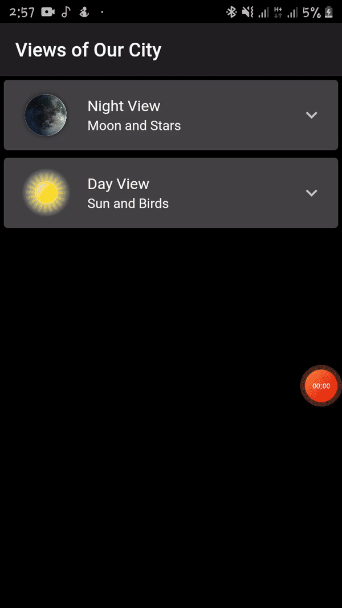

# ExpandedTile-Example
Today i have learnet the way a git expanded tile works. It make your UI more interactive and user engaging. I have tried to play with it a bit as I was craving to learn something new in the flutter and tried implementing that. :)

